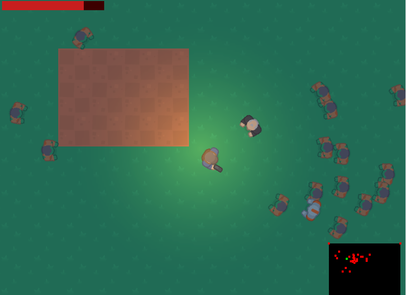

# Last Stand

**Last Stand** is a top-down arena survival game built on [Storm! Engine v2](https://github.com/SamsWebs/storm-engine-v2). Kite the horde, shoot what closes in, and trade retreat for time while the spawn ramp keeps climbing until you die.

- **Core loop**: move with WASD → aim with the mouse → click to fire → get hit → retreat to regen while the arena fills behind you
- **Continuous spawn ramp**: the rate climbs the whole run (`SpawnsPerSecond`), enemies spawn outside the camera but inside the arena, robots join after two minutes, old men later still
- **Regen with a price**: health climbs back after 3 untouched seconds, but every second spent waiting is a second the ramp spends spawning
- **Melee-only enemies**: zombie, robot and old man chase, face their target, and push apart so a crowd reads as a crowd instead of a stack
- **Pooled bullets that park honestly**: 128 bullets claimed from a free-list, inactive ones parked one per broadphase cell so they never pair with each other
- **Weapon pickups change the gun and the look**: gun, machine (fast, spread) and silencer (slow, 2 damage) swap fire rate and the survivor sprite
- **Minimap and HUD after lighting**: health bar, arena outline, player/enemy/pickup dots — drawn after the vignette so the UI stays bright
- **Pure-function unit tests** cover aim, regen, the spawn curve, wall resolution, the pool free-list and the world→minimap transform (`specs/`, run with `make -f Makefile.specs test`)

Clean C++17, no frameworks beyond SDL2 + the engine. Build: `make && make run`.



Built on [Storm! Engine v2](https://github.com/SamsWebs/storm-engine-v2) 2.3.0.

## Controls

| Input | Action |
|-------|--------|
| `W` / `A` / `S` / `D` | Move |
| Mouse | Aim (the survivor turns to face the cursor) |
| Click | Fire |
| `R` | Restart after death |
| `Esc` | Quit |

**Gamepad (Xbox-style layout)**: left stick moves, right stick aims, right
trigger or `A` fires, `Start` / `A` restarts after death, d-pad moves when the
left stick is dead.

## Why this game

As an example for **Storm! Engine**. Arena survival is the load-bearing test for four engine pieces used as designed: `ContactSystem::SetPairFilter` rejecting bullet-vs-bullet pairs before the manifold, the uniform-grid broadphase under sustained entity churn with id recycling, a camera-clamped view drawn through `RenderSystem`, and one `LightingOverlay` key light on the player at screen centre. Everything else — aim, regen, the spawn curve, wall resolution, the pool, the minimap transform — is pure, testable code with no engine dependency, which is what keeps a horde game honest.

### What it will not showcase

No sound, no ranged enemies, no boss, no second arena. Enemies are melee-only by design, so only the player fires and the pool stays single-team. Walls are grid-snapped, never collider entities — one collider per tile catches on seams.

## Build

### Linux

The engine must be installed first (`sudo make -f Makefile.debian install` in the engine tree). Then:

```bash
make          # build
make run      # run from this directory - asset paths are CWD-relative
```

### Tests

BDD specs via igloo, one binary per area. The pure logic (aim, regen, spawn
curve, walls, the bullet pool, the minimap transform) links without the renderer.

```bash
make -f Makefile.specs test             # every spec
make -f Makefile.specs test-ramp        # one area
```

### Windows (x64, MinGW-w64 cross-compile from Linux)

Download the SDK zip from the [Storm! Engine releases](https://github.com/SamsWebs/storm-engine-v2/releases/latest), unpack it, and point `SDK` at the unpacked directory:

```bash
sudo apt install mingw-w64
make -f Makefile.win SDK=~/sdk/stormengine2-2.3.0-win64
```

**MinGW-w64 only.** MSVC cannot link this, the import library and C++ ABI are GCC's.

## Raspberry Pi / Android / LibNX

The engine is portable, so this project is portable. You will need a platform Makefile and a platform `main()` that calls `Game::Run()`; see the engine's `examples/`.

`SCAFFOLD.md` documents the layout and the traps that come with it.

## License

Totally free, do what you want, but don't blame me if it breaks. [LICENSE.md](LICENSE.md) is the full text.
